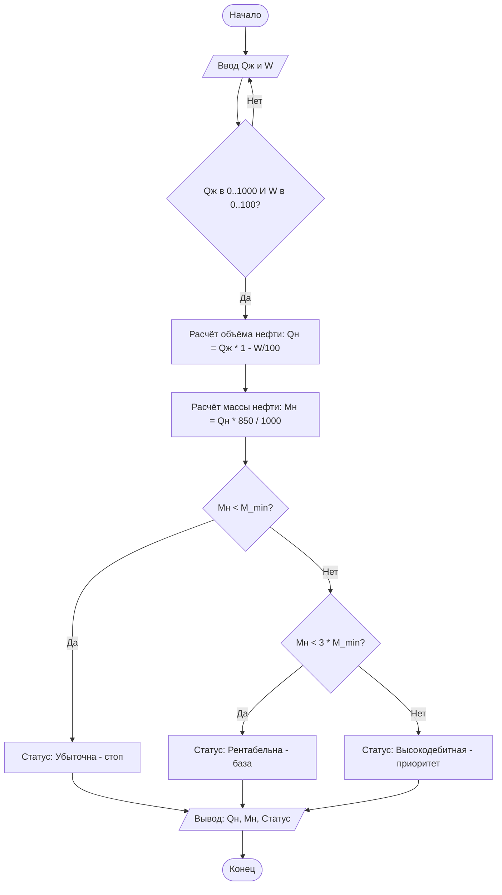

```mermaid
flowchart TD
 Start([Начало]) --> InputQ[/Ввод Qж и W/]
 InputQ --> CheckValid{Qж в 0..1000 И W в 0..100?}
 CheckValid -- Нет --> InputQ
 CheckValid -- Да --> CalcVol[Расчёт объёма нефти: Qн = Qж * 1 - W/100]
 CalcVol --> CalcMass[Расчёт массы нефти: Mн = Qн * 850 / 1000]
 CalcMass --> Cond1{Mн < M_min?}
 Cond1 -- Да --> Status1[Статус: Убыточна - стоп]
 Cond1 -- Нет --> Cond2{Mн < 3 * M_min?}
 Cond2 -- Да --> Status2[Статус: Рентабельна - база]
 Cond2 -- Нет --> Status3[Статус: Высокодебитная - приоритет]
 Status1 --> Output[/Вывод: Qн, Mн, Статус/]
 Status2 --> Output
 Status3 --> Output
 Output --> End([Конец])
```

